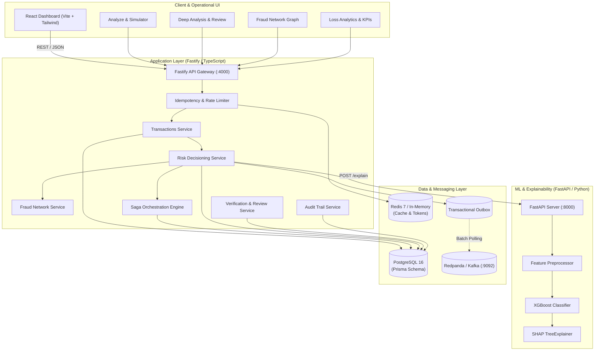
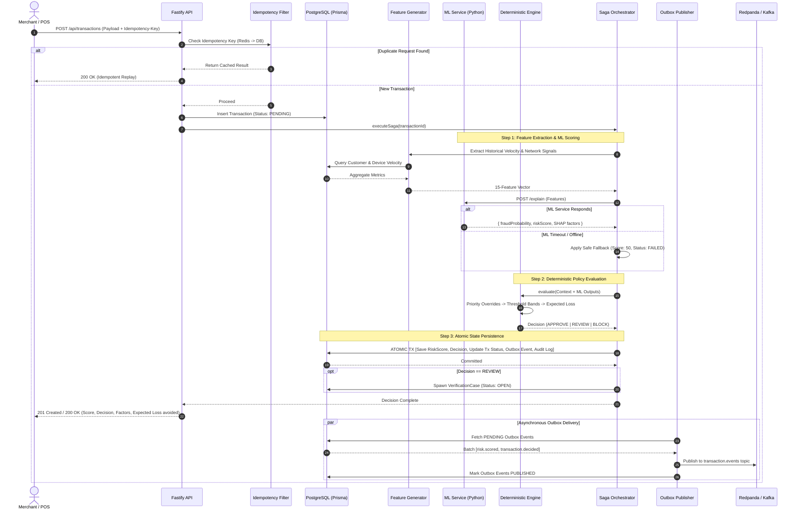
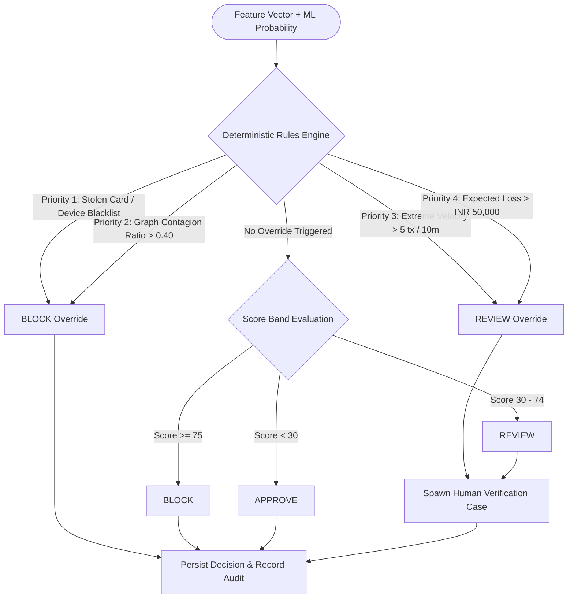
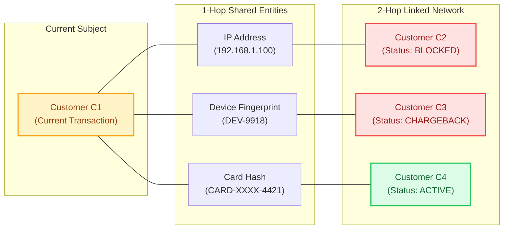
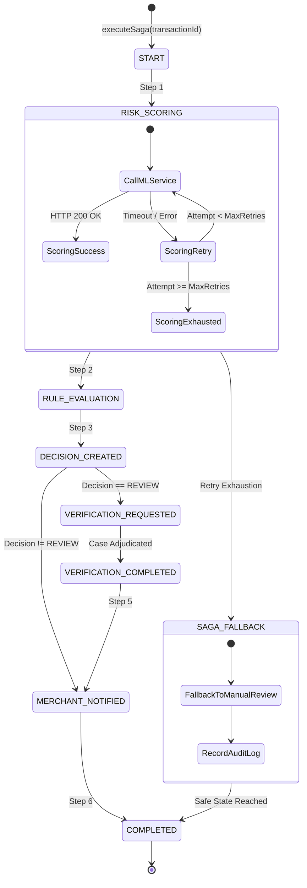

# 🛡️ RiskMesh

### Enterprise AI Fraud Risk, Explainable Decisioning & Loss Prevention Platform

RiskMesh is a production-grade, explainable fraud-decisioning and revenue protection platform built with **Node.js, Fastify, TypeScript, Python, FastAPI, XGBoost, SHAP TreeExplainer, PostgreSQL, Prisma ORM, Redis, Redpanda / Kafka, Distributed Saga Orchestration, Transactional Outbox, Idempotency, and a React Operational Dashboard**.

---

## 📌 Project Overview

**RiskMesh** is an engineering-first fraud risk management platform designed to stop high-risk and fraudulent payments without blindly declining legitimate customers or causing false-positive revenue leakage.

Rather than treating fraud detection as a black-box binary filter or single-point ML calculation, RiskMesh implements a resilient, multi-stage decisioning lifecycle:

```text
Payment Ingestion
       ↓
Validate, Rate-Limit & Deduplicate (Idempotency)
       ↓
Build Behavioral, Velocity & Network Graph Features
       ↓
ML Fraud Probability (XGBoost) + Feature Impact (SHAP)
       ↓
Deterministic Business Rules & Priority Overrides
       ↓
Decision Action: APPROVE | REVIEW | BLOCK + Expected Loss
       ↓
Distributed Saga Orchestrator (Checkpointing & State Persistence)
       ↓
Human Verification Queue (When Ambiguous)
       ↓
Transactional Outbox Event Staging
       ↓
Asynchronous Kafka Event Streaming
       ↓
Immutable Audit Trail & Loss Prevention Analytics
```

The system is designed around core backend and distributed-systems concerns: **low-latency explainability, idempotency guarantees, fault-tolerant fallbacks, graph-based syndicate detection, transactional outbox delivery, recoverable saga workflows, and complete operational auditability**.

---

## 🚨 Problem Statement

Digital merchants and payment processors lose billions annually to payment fraud and chargebacks. However, traditional fraud prevention systems suffer from four severe architectural and operational flaws:

1. **Black-Box Decisions & False Positives:** Monolithic risk scores decline high-value loyal customers without actionable explanations, damaging customer lifetime value.
2. **Transaction-Level Blindspots:** Scoring transactions in isolation fails to identify coordinated fraud rings sharing device fingerprints, virtual IPs, or stolen payment methods across multiple customer identities.
3. **Cascading External Dependency Failures:** If an ML service or cache cluster slows down or fails, payment pipelines either halt completely or blindly pass unvetted transactions.
4. **Duplicate Webhooks & State Inconsistencies:** Network retries, gateway timeouts, and async event delivery without strict idempotency cause double-charges, repeated decisions, and race conditions.

### How RiskMesh Solves This

| Challenge | RiskMesh Solution |
|---|---|
| **Black-Box Decisions** | Real-time **SHAP (SHapley Additive exPlanations)** factor decomposition ranking top positive and negative risk contributors. |
| **Coordinated Fraud Rings** | **2-Hop Fraud Network Intelligence** calculating contagion ratios across shared IPs, device IDs, and payment instruments. |
| **ML / Service Outages** | **Resilient Fallback Pipelines** with deterministic safety defaults, circuit breaking, and automated human-review escalation. |
| **State Duplication & Inconsistency** | **Redis + DB-backed Idempotency**, **Transactional Outbox**, and **Resumable Saga Workflows**. |

---

## 💡 High-Level Architecture

RiskMesh follows a decoupled, event-driven, layered microservices architecture:

```text
┌─────────────────────────────────────────────────────────┐
│              React Operational Dashboard                │
│         (Merchant UI, Deep Analysis, Network Graph)     │
└────────────────────────────┬────────────────────────────┘
                             │ HTTPS / REST
                             ▼
┌─────────────────────────────────────────────────────────┐
│           Fastify & TypeScript Backend API              │
│       (Port 4000: Modules, Ingestion, Decisioning)      │
└────────────┬───────────────┬──────────────────┬─────────┘
             │               │                  │
             │ HTTP / JSON   │ Redis Cache      │ Prisma ORM
             ▼               ▼                  ▼
┌─────────────────────────┐ ┌───────────────┐ ┌───────────┐
│   Python ML Service     │ │    Redis 7    │ │PostgreSQL │
│ (XGBoost + SHAP Engine) │ │(Idempotency / │ │(ACID /    │
│       Port 8000         │ │ Rate-Limit)   │ │Saga/Outbox│
└─────────────────────────┘ └───────────────┘ └─────┬─────┘
                                                    │
                                             Outbox │ Poller
                                                    ▼
                                            ┌─────────────┐
                                            │  Redpanda / │
                                            │    Kafka    │
                                            └─────────────┘
```



---

## 🔄 Complete Transaction Processing Flow

The end-to-end processing pipeline guarantees that every payment is validated, enriched, scored, evaluated against business rules, and safely persisted with full idempotency:



---

## 🧠 Explainable ML & Intelligence Engine

The machine learning service (`ml-service/`) runs on **FastAPI** with **XGBoost** and **SHAP (SHapley Additive exPlanations)**.

### Model Architecture & Training
* **Classifier:** XGBoost gradient boosted decision tree tuned for tabular fraud features.
* **Imbalance Handling:** Training-derived `scale_pos_weight` to address fraud rarity.
* **Partitioning:** Strict 70% Training / 15% Validation / 15% Held-out Test split.
* **Feature Pipeline:** Standard scaling and one-hot encoding fitted exclusively on the training partition to prevent data leakage.

### Real-Time Explainability
For every inference request, the Python service executes a SHAP `TreeExplainer` over the feature set, returning:
1. `fraudProbability`: Calibrated model probability $P(\text{fraud}) \in [0.0, 1.0]$.
2. `riskScore`: Normalized integer score $\in [0, 100]$.
3. `riskFactors`: Ranked array of top positive (risk-increasing) and negative (trust-increasing) contributors with explicit explanations.

```json
{
  "fraudProbability": 0.934,
  "riskScore": 93,
  "modelVersion": "xgboost-v1.0",
  "riskFactors": [
    {
      "feature": "velocity_10m",
      "impact": "high",
      "contribution": 0.412,
      "explanation": "Velocity of 6 transactions in 10 minutes is abnormally elevated."
    },
    {
      "feature": "network_contagion_score",
      "impact": "high",
      "contribution": 0.358,
      "explanation": "Device linked to 2 known chargeback accounts."
    }
  ]
}
```

---

## ⚖️ Hybrid Decision Engine & Policy Bands

RiskMesh strictly separates **statistical estimation** from **financial execution**. The ML model outputs probability; the deterministic decision engine decides whether to move money.



### Decision Bands & System Actions

| Risk Score | Probability Band | Outcome | Operational Action |
|:---:|:---:|:---:|---|
| **0 – 29** | $0.00 - 0.29$ | `APPROVE` | Frictionless auto-authorization. Low fraud likelihood. |
| **30 – 74** | $0.30 - 0.74$ | `REVIEW` | Escalates to human verification queue for investigation. |
| **75 – 100** | $0.75 - 1.00$ | `BLOCK` | Declines payment; records avoided financial loss. |

### Expected Loss Equation
$$\text{Expected Loss} = \text{Amount} \times \min\Big(1.0, \max\big(0.0, P(\text{fraud})\big)\Big)$$

*Example:* For an INR 85,000 transaction with $P(\text{fraud}) = 0.93$, the expected loss is **INR 79,050**. When blocked, RiskMesh logs INR 79,050 in avoided loss exposure.

---

## 🕸️ Fraud Network & Graph Intelligence

Transaction-level scoring cannot detect distributed fraud rings. RiskMesh builds a multi-hop entity graph dynamically across historical customer records:



### Graph Analysis Workflow
1. **Entity Linking:** Evaluates shared device IDs, IP subnets, and payment instruments across transactions.
2. **Contagion Ratio Calculation:** Computes:
   $$\text{Contagion Ratio} = \frac{\text{Blocked or Chargebacked Linked Nodes}}{\text{Total Linked Nodes}}$$
3. **Syndicate Policy Escalation:** When the contagion ratio exceeds 40%, the deterministic rule engine automatically overrides low ML scores and forces a `BLOCK` or `REVIEW`.

---

## 🔄 Distributed Saga Pattern & Recovery

Rather than holding dangerous long-running database transactions across external ML and messaging calls, RiskMesh uses an **Orchestrated Saga Pattern** (`RiskDecisionSaga`):



### Saga Capabilities
* **Step Checkpointing:** Every transition (`START`, `RISK_SCORING`, `RULE_EVALUATION`, `DECISION_CREATED`, `VERIFICATION_REQUESTED`, `COMPLETED`) is written to `risk_decision_sagas` and `saga_step_logs`.
* **Crash Resilience & Resume:** A interrupted or failed saga can be safely resumed from its last completed step via `POST /api/saga/decision/:transactionId`.
* **Idempotent Completion Guard:** If a saga has already reached `COMPLETED`, re-invocations return immediately without re-executing steps.

---

## 🛡️ Reliability & Distributed Systems Patterns

```text
┌─────────────────────────────────────────────────────────────────────────────────────────┐
│                                   RELIABILITY DESIGN MATRIX                             │
├─────────────────────────┬──────────────────────────────────┬────────────────────────────┤
│ Subsystem               │ Potential Failure Mode           │ RiskMesh Mitigation Path   │
├─────────────────────────┼──────────────────────────────────┼────────────────────────────┤
│ ML Inference Service    │ Network timeout (>2000ms) / 5xx  │ Fallback score (50), safe  │
│                         │                                  │ REVIEW escalation, audit   │
├─────────────────────────┼──────────────────────────────────┼────────────────────────────┤
│ Redis Cache Cluster     │ Connection drop / eviction / OOM │ Automatic in-memory cache  │
│                         │                                  │ and direct DB validation   │
├─────────────────────────┼──────────────────────────────────┼────────────────────────────┤
│ Redpanda / Kafka Broker │ Network partition / broker down  │ Transactional Outbox stays │
│                         │                                  │ PENDING in DB and retries  │
├─────────────────────────┼──────────────────────────────────┼────────────────────────────┤
│ Client / Webhook Retry  │ Duplicate payment requests       │ Idempotency-Key validation │
│                         │                                  │ replays saved response     │
├─────────────────────────┼──────────────────────────────────┼────────────────────────────┤
│ Node Process Crash      │ Server restart mid-decision      │ Resumable Saga pattern     │
│                         │                                  │ recovers from checkpoint   │
└─────────────────────────┴──────────────────────────────────┴────────────────────────────┘
```

### 1. Robust Idempotency Filter
Prevents duplicate financial operations caused by client timeouts, network drops, and webhook retries:
* `Same Key + Same Payload` $\rightarrow$ Replays stored response immediately (zero side effects).
* `Same Key + Different Payload` $\rightarrow$ Returns `HTTP 409 Conflict`.
* Short-term tokens cached in Redis; durable records persisted in PostgreSQL `idempotency_records`.

### 2. Transactional Outbox Pattern
Solves the dual-write problem between PostgreSQL and Redpanda/Kafka:
1. Transaction and domain events commit together in a single PostgreSQL ACID transaction.
2. Background worker polls `outbox_events` table in batches.
3. Successfully published messages are marked `PUBLISHED`; failed messages are retried with exponential backoff.

### 3. Immutable Audit Logging
Every operational decision, status transition, ML failure, rule evaluation, and review override creates an immutable record in `audit_events` containing the entity ID, event type, timestamp, and JSON metadata.

---

## 👥 Human Verification & Review Queue

When a transaction falls into the `REVIEW` band (Score 30–74) or triggers a review rule:
1. A **Verification Case** is automatically spawned with status `OPEN`.
2. Risk analysts inspect the transaction in the **Deep Analysis** view (`RiskCasesPage.tsx`).
3. Analysts can **Approve**, **Deny**, or **Escalate** the case with decision notes.
4. The transaction status is updated atomically, outbox events are published, and an audit trail entry is logged.

---

## 📊 Analytics & Loss Prevention Telemetry

The platform provides extensive operational monitoring across multiple specialized dashboards:
* **Operational Dashboard (`DashboardPage.tsx`):** Ingestion volume, approval rates, review backlog, and real-time loss exposure avoided.
* **Return Risk Scorer (`ReturnRiskScorerPage.tsx`):** Predicts return fraud and abusive policy exploitation.
* **Spike Detector (`SpikeDetectorPage.tsx`):** Real-time anomaly detection identifying velocity bursts and coordinated attack spikes.
* **Chargeback Responder (`ChargebackResponderPage.tsx`):** Automated dispute evidence compiler and chargeback intelligence.
* **Model Performance (`ModelPerformancePage.tsx`):** Live ROC-AUC, PR-AUC, confusion matrix, and threshold tuning curves from held-out validation benchmarks.

---

## 📁 Repository Structure

```text
razor/
├── backend/
│   ├── prisma/
│   │   └── schema.prisma              # PostgreSQL schema (Customers, Transactions, Sagas, Outbox)
│   ├── src/
│   │   ├── config/                    # Typed environment configuration
│   │   ├── infrastructure/
│   │   │   ├── database/              # Prisma client & connection pool
│   │   │   ├── events/                # Domain event types & topic mappings
│   │   │   ├── idempotency/           # Redis + DB idempotency service
│   │   │   ├── kafka/                 # Redpanda / Kafka producer & consumer
│   │   │   ├── ml/                    # Resilient HTTP client for Python ML service
│   │   │   ├── outbox/                # Transactional Outbox repository & poller
│   │   │   └── redis/                 # Redis client with in-memory degradation
│   │   ├── middleware/                # Rate limiter, error handling, not-found handlers
│   │   ├── modules/
│   │   │   ├── analytics/             # Loss metrics & KPI aggregation
│   │   │   ├── audit/                 # Immutable audit logging service
│   │   │   ├── fraud/                 # 2-Hop graph intelligence & contagion scoring
│   │   │   ├── risk/                  # Feature generation, ML client, decision engine
│   │   │   ├── saga/                  # Distributed Saga orchestrator & recovery
│   │   │   ├── transactions/          # Ingestion, query, and manual status override
│   │   │   └── verification/          # Human review queue & case adjudication
│   │   ├── routes.ts                  # Central API route registration
│   │   ├── app.ts                     # Fastify application setup
│   │   └── server.ts                  # Server bootstrap & graceful shutdown
│   └── tests/                         # Unit, integration, and resilience test suites
│
├── ml-service/
│   ├── artifacts/                     # Serialized XGBoost model, metrics, feature metadata
│   ├── src/
│   │   ├── app.py                     # FastAPI server (/predict, /explain, /health)
│   │   ├── config.py                  # Model hyperparameters and path configuration
│   │   ├── evaluation.py              # ROC, PR-AUC, confusion matrix evaluation
│   │   ├── explainability.py          # SHAP TreeExplainer implementation
│   │   ├── model.py                   # XGBoost training & inference wrappers
│   │   ├── preprocessing.py           # Feature transformers and scalers
│   │   └── train.py                   # Model training pipeline
│   └── requirements.txt               # Python dependencies (FastAPI, XGBoost, SHAP, etc.)
│
├── frontend/
│   ├── src/
│   │   ├── api/                       # Typed HTTP API client & endpoints
│   │   ├── components/                # Reusable UI components, modals, visualizers
│   │   ├── pages/                     # Application pages (Analyze, Dashboard, Graph, Cases)
│   │   ├── App.tsx                    # React router & navigation
│   │   └── main.tsx                   # React root mount
│   ├── package.json
│   └── vite.config.ts
│
├── docker-compose.yml                 # PostgreSQL 16, Redis 7, Redpanda (Kafka)
├── ARCHITECTURE.md                    # Detailed architecture specifications & sequence flows
├── DEMO_SCRIPT.md                     # 5-minute presentation & evaluation walkthrough
└── scripts/
    └── verify-stack.ps1               # Automated stack health verification script
```

---

## 🔌 API Specification

### Transaction Endpoints
| Method | Endpoint | Description | Idempotent |
|---|---|---|:---:|
| `POST` | `/api/transactions` | Ingest transaction, run scoring, record decision | Supported (`Idempotency-Key`) |
| `GET` | `/api/transactions` | List and filter transaction history | Yes |
| `GET` | `/api/transactions/:id` | Get full transaction details with risk score | Yes |
| `PATCH`| `/api/transactions/:id/status` | Manually update transaction status (`APPROVE` / `BLOCKED`) | Yes |

### Risk & Decision Endpoints
| Method | Endpoint | Description | Idempotent |
|---|---|---|:---:|
| `POST` | `/api/risk/score/:id` | Calculate or refresh ML risk score and SHAP factors | Yes |
| `POST` | `/api/risk/decision/:id` | Evaluate deterministic decision rules and score bands | Yes |

### Fraud Network & Graph Endpoints
| Method | Endpoint | Description | Idempotent |
|---|---|---|:---:|
| `GET` | `/api/fraud/network/:customerId` | Build 2-hop network graph and calculate contagion score | Yes |

### Distributed Saga Endpoints
| Method | Endpoint | Description | Idempotent |
|---|---|---|:---:|
| `POST` | `/api/saga/decision/:transactionId` | Start or resume a multi-step risk decision saga | Yes |
| `GET` | `/api/saga/decision/:transactionId` | Inspect saga execution state, checkpoints, and step logs | Yes |

### Verification & Case Endpoints
| Method | Endpoint | Description | Idempotent |
|---|---|---|:---:|
| `GET` | `/api/verification/cases` | List pending manual review cases | Yes |
| `PATCH`| `/api/verification/cases/:id` | Adjudicate review case (`APPROVED`, `REJECTED`, `ESCALATED`)| Yes |

### Analytics & Audit Endpoints
| Method | Endpoint | Description | Idempotent |
|---|---|---|:---:|
| `GET` | `/api/analytics/dashboard-summary` | Aggregate KPIs, approval ratios, and avoided loss | Yes |
| `GET` | `/api/analytics/model-performance` | Held-out model validation metrics & confusion matrix | Yes |
| `GET` | `/api/audit/events` | Query immutable audit trail logs | Yes |

---

## ⚡ Failure Scenarios & Edge Case Handling

### Scenario 1 — Duplicate Client Request (Idempotency)
```text
Client Request ──> [ Idempotency Check ]
                         │
                         ├── Match Found ──> Return Saved Response (No re-scoring, no double-charge)
                         └── No Match ────> Execute Full Pipeline
```

### Scenario 2 — ML Service Offline or Timed Out
```text
Fastify Backend ──> [ ML Service HTTP POST /explain ]
                           │
                           ├── Timeout (>2000ms) / 5xx Crash
                           ▼
                    [ Resilient Safe Fallback ]
                           │
                           ├── Assign Fallback Score: 50
                           ├── Flag Status: FAILED
                           ├── Escalate to Manual Review Queue
                           └── Record Priority Audit Event
```

### Scenario 3 — Saga Recovery After Mid-Execution Failure
```text
Saga Execution ──> Step 1 (Completed) ──> Step 2 (Failed / Crash)
                                                 │
                                                 ▼
[ Resume Request ] ──> Load Checkpoint ──> Resume from Step 2 ──> Completed
```

### Scenario 4 — Kafka Broker Disconnection
```text
Decision Committed ──> [ Write PostgreSQL Outbox Event (PENDING) ]
                                 │
                                 ▼
                         [ Outbox Poller ]
                                 │
                                 ├── Kafka Offline ──> Keep PENDING, Backoff & Retry
                                 └── Kafka Online ───> Publish & Mark PUBLISHED
```

---

## 💻 Local Development & Quickstart

### Prerequisites
* **Node.js:** `20.x` or `22.x LTS`
* **Python:** `3.11` or newer
* **Docker Desktop:** with Compose enabled
* **PowerShell** (Windows) or **Bash** (Linux / macOS)

---

### Step 1: Environment Configuration
Copy the environment template:
```bash
cp .env.example .env
```

---

### Step 2: Start Infrastructure Services
Spin up PostgreSQL, Redis, and Redpanda (Kafka):
```bash
docker compose up -d
```
* PostgreSQL: `localhost:5432`
* Redis: `localhost:6379`
* Redpanda / Kafka: `localhost:9092` (Console: `localhost:8080`)

---

### Step 3: Start Python ML & Explainability Service
```bash
cd ml-service
python -m venv venv
# Windows:
.\venv\Scripts\activate
# Linux/macOS:
source venv/bin/activate

pip install -r requirements.txt
uvicorn src.app:app --host 0.0.0.0 --port 8000 --reload
```
* ML Health Check: `http://localhost:8000/health`
* ML Docs: `http://localhost:8000/docs`

---

### Step 4: Start Fastify Backend API
```bash
cd backend
npm install
npx prisma generate
npx prisma db push
npm run dev
```
* Backend API: `http://localhost:4000`
* Backend Health: `http://localhost:4000/health`

---

### Step 5: Start React Operational Dashboard
```bash
cd frontend
npm install
npm run dev
```
* Dashboard URL: `http://localhost:5173`

---

### Step 6: Verify the Entire Stack
Run the automated multi-service verification script:
```powershell
.\scripts\verify-stack.ps1
```
The script validates Docker container statuses, checks backend and ML health endpoints, and confirms frontend availability.

---

## 🧪 Testing & Quality Assurance

```bash
# Run Backend Unit, Integration, and Resilience Tests
cd backend
npm test

# Run Backend Linter & Typecheck
npm run lint
npm run build

# Run ML Service Test Suite
cd ../ml-service
python -m pytest

# Validate Frontend Production Build
cd ../frontend
npm run build
```

### Test Coverage Highlights
* **Decision Engine Tests:** Verifies all deterministic rules, threshold boundaries, and expected loss calculations.
* **Network Graph Tests:** Tests 2-hop neighbor expansion, cycle detection, and contagion scoring.
* **Resilience Tests:** Simulates ML timeouts, Redis outages, saga step recovery, and duplicate idempotency calls.
* **ML Tests:** Validates preprocessing pipelines, XGBoost inference shapes, and SHAP explanation vectors.

---

## ☁️ Deployment & Production Security

```text
┌───────────────────────┐         ┌───────────────────────┐
│        Vercel         │         │        Railway        │
│   (React Frontend)    │         │ (Fastify Backend API) │
└───────────┬───────────┘         └───────────┬───────────┘
            │ HTTPS                           │
            ▼                                 ▼
┌───────────────────────┐         ┌───────────────────────┐
│     AWS / Railway     │         │   Railway / Managed   │
│   (FastAPI ML Engine) │         │ (PostgreSQL 16+Redis) │
└───────────────────────┘         └───────────────────────┘
```

### Production Security Rules
1. **Zero Hardcoded Secrets:** All database passwords, Redis URIs, API keys, and JWT secrets are injected strictly via environment variables.
2. **Safe Fallback Boundaries:** The AI model is never granted autonomous money-movement authorization; all decisions flow through deterministic policy guardrails.
3. **Database Uniqueness Constraints:** Hard database unique indexes on `transaction_id`, `idempotency_key`, and `external_customer_id` prevent race conditions under high concurrency.

---

## 🔮 Roadmap & Future Enhancements

- [ ] **Distributed Multi-Tenant Partitioning:** Tenant-isolated rule engines and custom ML thresholds per merchant.
- [ ] **Automated Model Retraining & Drift Monitoring:** PSI (Population Stability Index) and Kolmogorov-Smirnov drift detection triggers.
- [ ] **OpenTelemetry & Distributed Tracing:** Unified Jaeger traces across Fastify, FastAPI, and Kafka consumers.
- [ ] **Vector-Based Identity Similarity:** Embedding-based fuzzy matching for synthetic identity detection.
- [ ] **Streaming Graph Analytics:** Real-time Neo4j / Apache Flink integration for multi-million-node fraud syndicates.

---

## 👨‍💻 Engineering Principles

RiskMesh is built upon fundamental backend and distributed engineering principles:
* **Separation of Concerns:** Statistical probability estimation is strictly decoupled from deterministic policy enforcement.
* **Fail-Safe by Default:** External dependency degradation automatically fails into a secure human-review queue rather than silently authorizing transactions.
* **State Durability:** Sagas and Transactional Outboxes ensure zero message loss and complete recovery across unexpected restarts.
* **Explainability Over Black-Boxes:** Every risk decision is accompanied by human-interpretable SHAP factors for full merchant auditability.

---

## 📄 Documentation Links
* [ARCHITECTURE.md](ARCHITECTURE.md) — Detailed block diagrams, sequence flows, ERD, and component specs.
* [DEMO_SCRIPT.md](DEMO_SCRIPT.md) — 5-minute timed presentation script for live demonstrations.

---

## 📜 License
This project is developed for demonstration, production architecture evaluation, and hackathon presentation.
